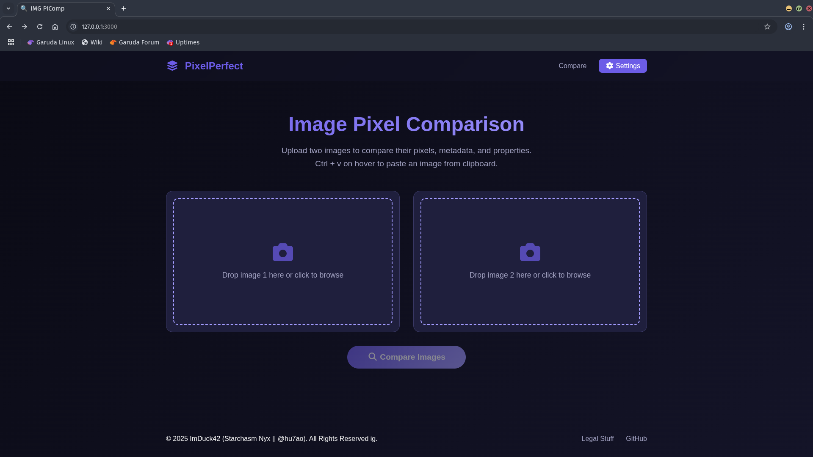
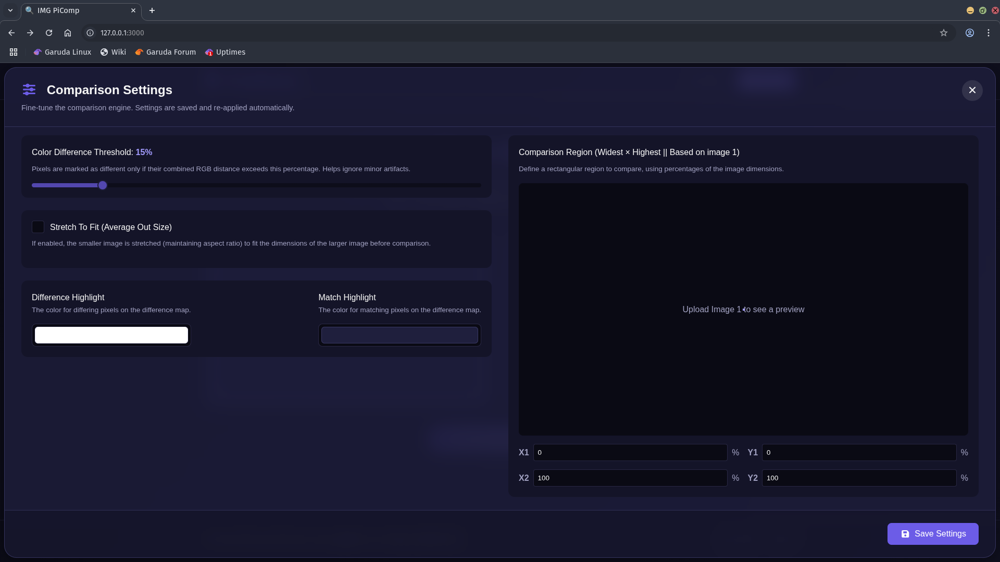
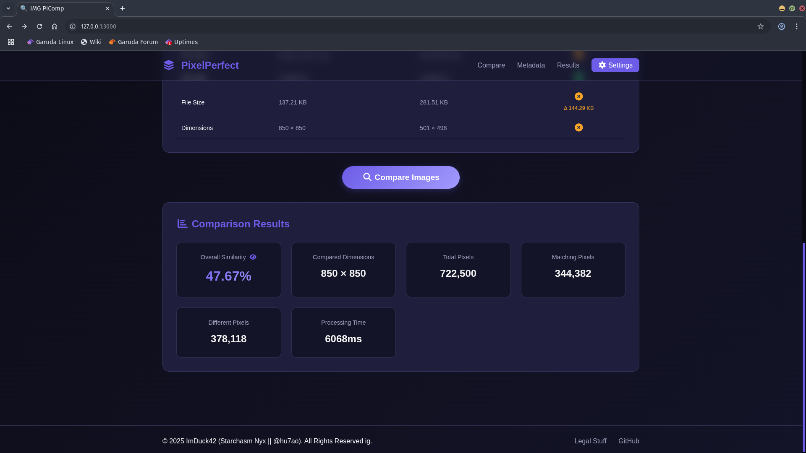
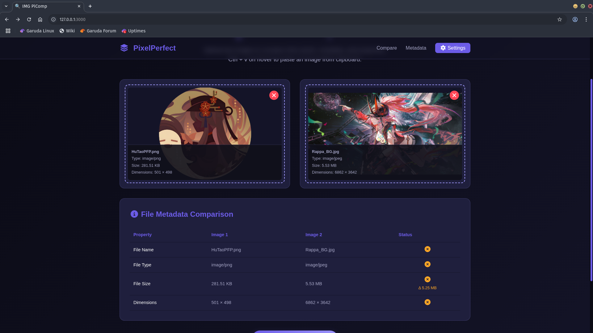

# PixelPerfect (IMG PiComp)

## 🌟 Features

### 🖼️ Image Handling & Uploads
*   **Multiple Upload Methods**:
    *   Click to browse your local files.
    *   Drag and drop images directly onto the upload areas.
    *   Paste an image from your clipboard (`Ctrl + V`) when hovering over an upload area.
*   **Instant Previews**: See your selected images and their file information (name, type, size, dimensions) immediately.
*   **Easy Removal**: Quickly clear an image to select a new one.

### ⚙️ Comparison Engine
*   **Asynchronous Processing**: The comparison runs in the background using `requestAnimationFrame`, ensuring the UI remains responsive even with large images.
*   **Real-time Progress**: Monitor the comparison with a detailed progress bar, live pixel-processed count, current scan position, and a real-time similarity score.
*   **Cancellable Operation**: Stop a long-running comparison at any time.
*   **Metadata Comparison**: An automatically generated table compares file properties (name, size, type, dimensions) side-by-side with clear status icons.

### 📊 Results & Visualization
*   **Comprehensive Report**: Get a full breakdown including overall similarity percentage, total pixels, matching pixels, differing pixels, and processing time.
*   **Pixel Difference Map**: Click the "eye" icon to open a modal showing a visual map of all discrepancies. Matching and differing pixels are highlighted with customizable colors.

### 🔧 Customization & Settings
All settings are **automatically saved** to your browser's `localStorage` on pressing "Save".
*   **Color Difference Threshold**: Use a slider to set a tolerance (0-100%) for what counts as a "different" pixel. This is perfect for ignoring minor compression artifacts or anti-aliasing.
*   **Region of Interest (ROI)**: Define a specific rectangular area to compare by setting percentage-based coordinates (X1, Y1, X2, Y2). A live visualizer helps you see the selected region.
*   **Smart Sizing**: Choose to stretch the smaller image to fit the larger one ("Stretch To Fit"), enabling comparison of differently sized but similar images. If disabled, images are centered.
*   **Custom Highlight Colors**: Use color pickers to choose the exact colors for "matching" and "differing" pixels on the difference map.

## 📸 Screenshots

<details>
<summary>Main Interface & Settings</summary>

| Main Interface | Settings & Region of Interest |
| -------------- | ---------------------------- |
|  |  |

</details>

<details>
<summary>Results & Metadata</summary>

| Results | Metadata Comparison |
| ------- | ------------------- |
|  |  |

</details>

## 🚀 How It Works

The entire application runs on the client-side. Here's a brief overview of the process:

1.  **Image Loading**: Images are loaded into `` elements and file information is extracted.
2.  **Canvas Preparation**: Before comparison, both images are drawn onto a hidden `<canvas>` element. This is where sizing logic (stretch or center) and region-of-interest selection are applied.
3.  **Pixel Data Extraction**: `getImageData()` is called on the canvas to get a `Uint8ClampedArray` containing the RGBA values for every pixel in the comparison area.
4.  **Chunked Comparison**: To prevent the browser from freezing, the pixel data array is processed in small chunks within a `requestAnimationFrame` loop.
5.  **Pixel Analysis**: For each pixel, the absolute difference of the R, G, and B values is summed up. This sum is compared against the user-defined `threshold`.
6.  **Results Aggregation**: Counts for matching and different pixels are tallied.
7.  **Difference Map Generation**: A new `ImageData` array is created simultaneously. Each pixel is colored based on whether it matched or differed, using the user-selected highlight colors.
8.  **Display**: Once the loop completes, the final statistics and the generated difference map are presented to the user.

## 🛠️ Technology Stack

*   **HTML5**: For the core structure and semantics.
*   **CSS3**: For styling, animations, and responsive design (Flexbox, Grid, custom properties).
*   **Vanilla JavaScript (ES6+)**: For all logic, DOM manipulation, and the comparison engine. No external frameworks or libraries (except for icons).
*   **Font Awesome**: For a rich set of icons used throughout the UI.

## USAGE

No installation is required. Simply open the `index.html` file in any modern web browser (like Chrome, Firefox, or Edge).

1.  Visit the **[Live Demo](https://imduck42.github.io/PiComp)** or open `index.html` locally.
2.  Upload your two images using one of the available methods.
3.  (Optional) Click the `Settings` button to fine-tune the comparison parameters.
4.  Click the **Compare Images** button.
5.  Review the results. If there are differences, click the `👁️` icon to view the Pixel Difference Map.

## 📁 File Structure

```
.
├── index.html      # The main HTML file
├── styles.css      # All styling for the application
└── script.js       # All JavaScript logic and the comparison engine
```

## 📜 License

This project is licensed under the MIT License.

---
> *© 2025 ImDuck42 (Starchasm Nyx || @hu7ao)*